### 1. Install CentOS /RHEL
downloaded successfully 
### 2. What is the difference between cat and more command?

cat --> go to the end of the file using scroll to go up
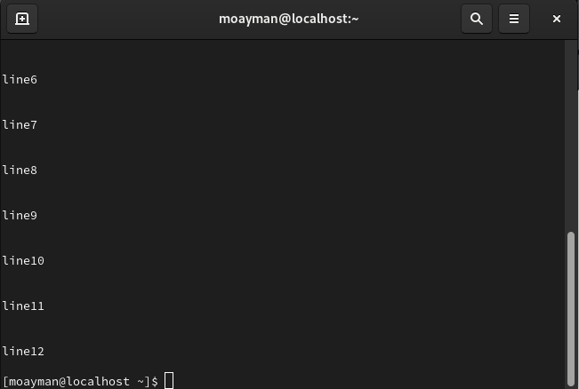

more --> start at the tp of the file and navigate file page by page
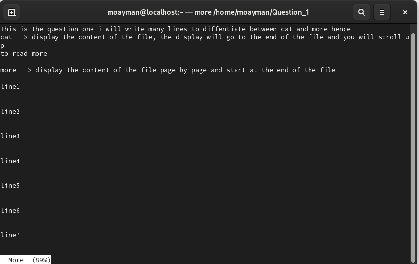

### 3. What is the difference between rm and rmdir using man?

rm --> using to remove files by default and directories

rmdir --> using to remove empty directories

### 4. Create the following hierarchy under your home directory:

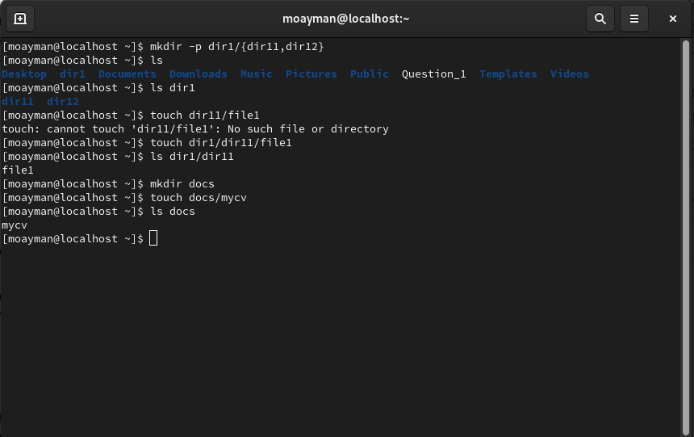

#### a. Remove dir11 in one-step. What did you notice? And how did you overcome that?

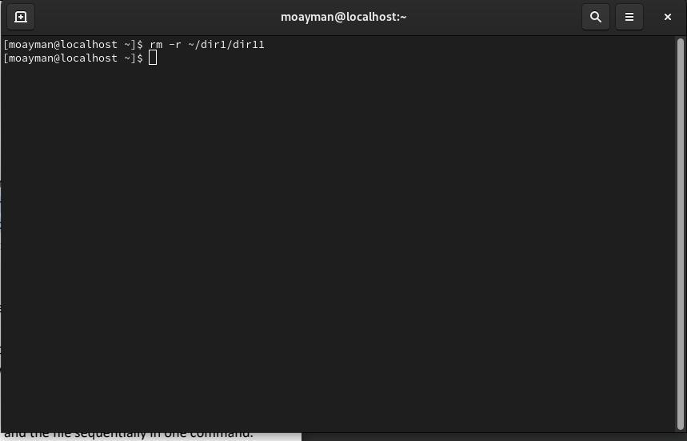

####    b. Then remove dir12 using rmdir –p command. State what happened to the   hierarchy (Note: you are in your home directory).

hierarchy was deleted (dir12 and its direct parent)

####    c. The output of the command pwd was /home/user. Write the absolute   and relative path for the file mycv

abs path ----> ~/docs/mycv  rel path ----> ./docs/mycv

### 5. Copy the /etc/passwd file to your home directory making its name is mypasswd.

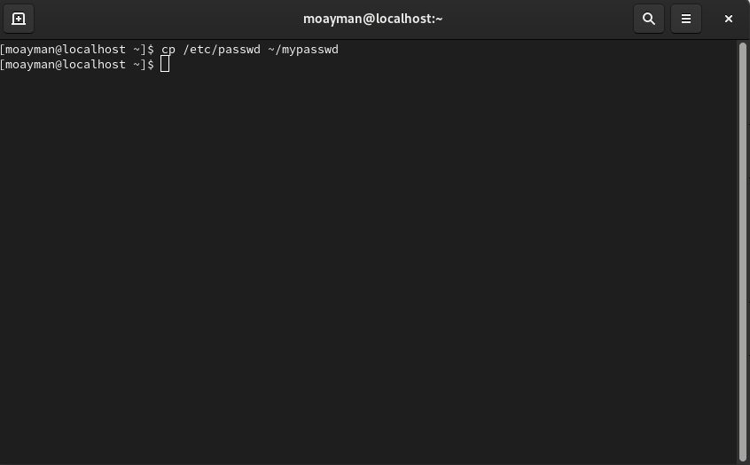

### 6. Rename this new file to be oldpasswd.

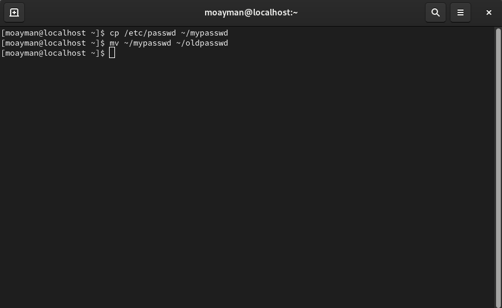

### 7. You are in /usr/bin, list four ways to go to your home directory

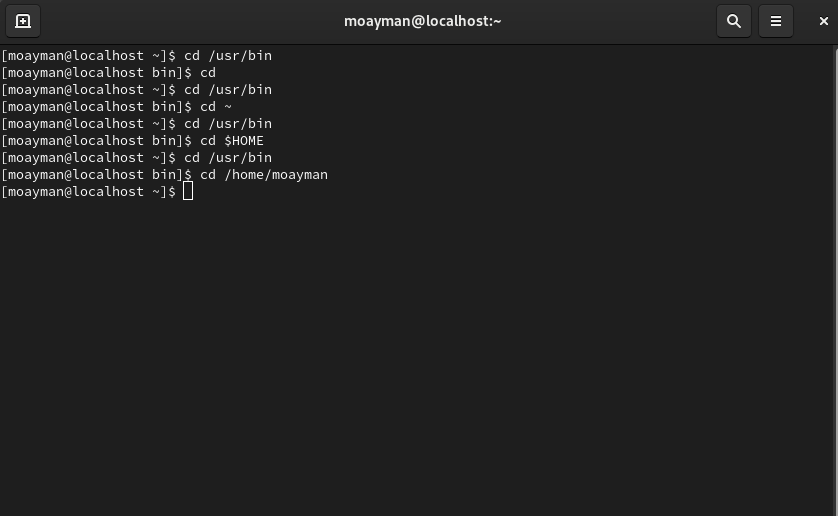

### 8. List Linux commands in /usr/bin that start with letter w

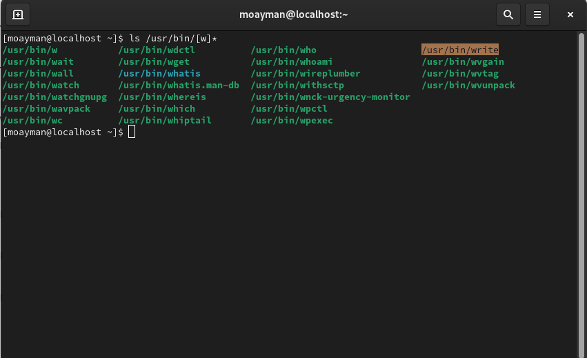

### 9. Display the first 4 lines of /etc/passwd

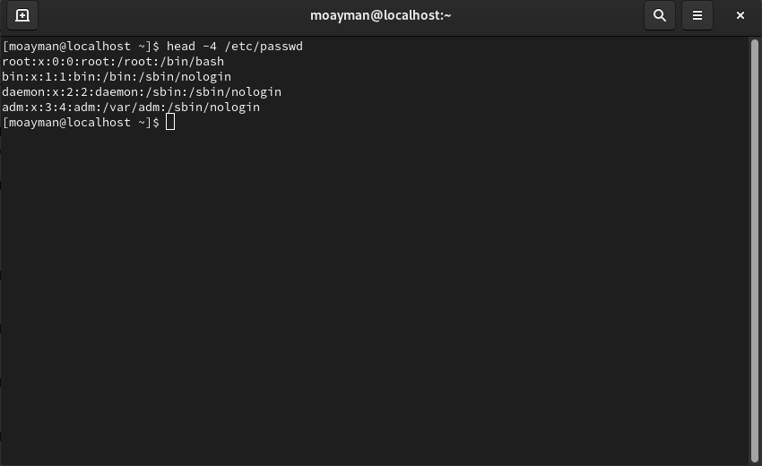

### 10.Display the last 7 lines of /etc/passwd

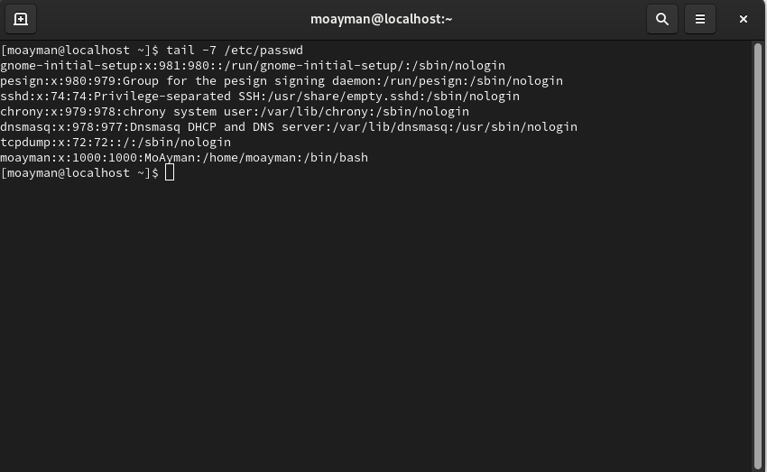

### 11.Display the man pages of passwd the command and the file sequentially in one command.

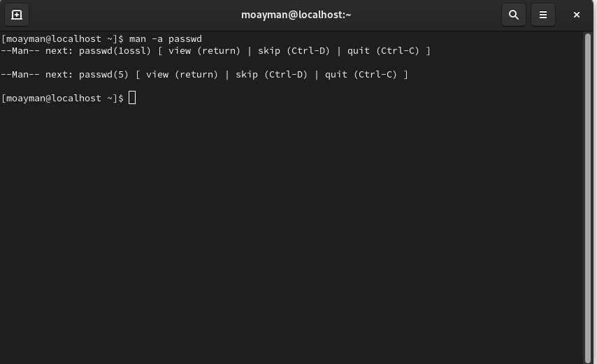

### 12.Display the man page of the passwd file.

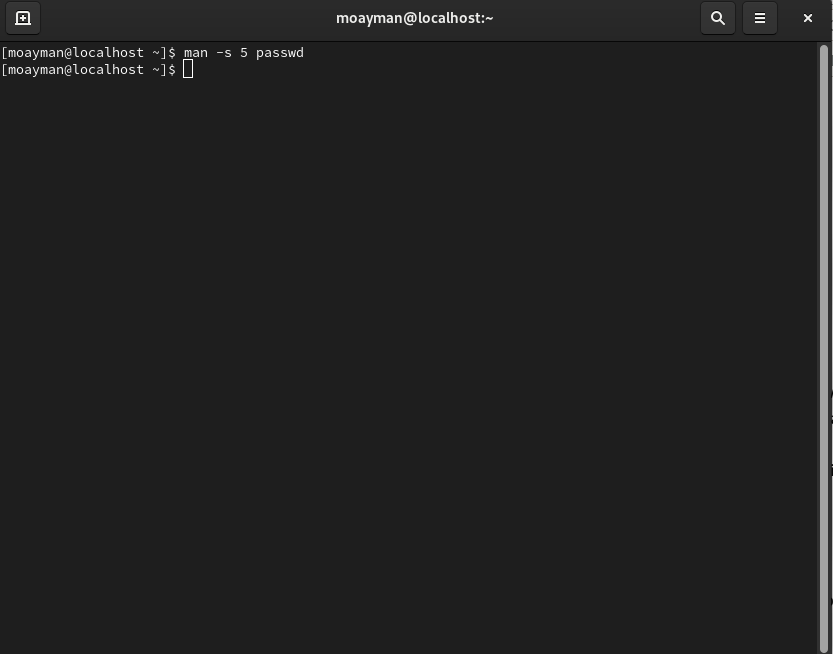

### 13.Display a list of all the commands that contain the keyword passwd in their man page.

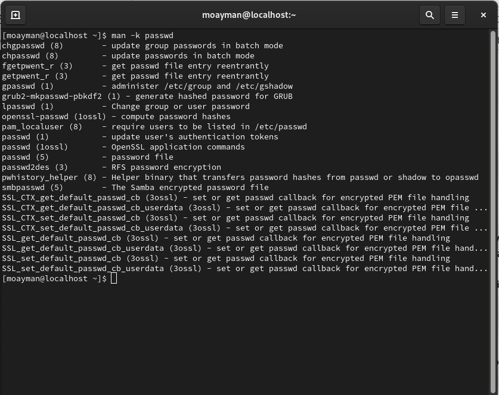

