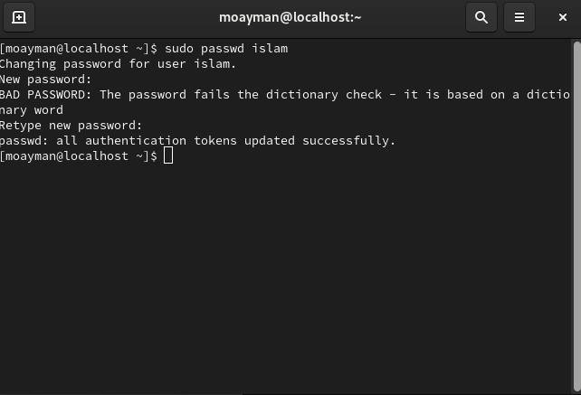

### 1. Create a user account with the following attribute

### 2. Create a user account with the following attribute

### 3. Create a supplementary (Secondary) group called pgroup with group ID of 30000

### 4. Create a supplementary group called badgroup

### 5. Add islam user to the pgroup group as a supplementary group

### 6. Modify the password of islam's account to password

### 7. Modify islam's account so the password expires after 30 days

### 8. Lock bad user account so he can't log in

### 9. Delete bad user account

### 10. Delete the supplementary group called badgroup.

### 13. Create a folder called myteam in your home directory and change its permissions to   read only for the owner.

### 14. Log out and log in by another user

### 15. Try to access (by cd command) the folder (myteam)

### 16. Using the command Line
####    - Change the permissions of oldpasswd file to give owner read and write permissions and for group write and execute and execute only for the others (using chmod in 2 different ways)

####    - Change your default permissions to be as above.

####    - What is the maximum permission a file can have, by default when it is just  created? And what is that for directory.

####    - Change your default permissions to be no permission to everyone then create a   directory and a file to verify.

### 17. What are the minimum permission needed for:
####    - Copy a directory (permission for source directory and permissions for target parent directory)

src ==> 400
dest ==> 300 

####    - Copy a file (permission for source file and and permission for target parent directory)

file ==> 400 (r--)
srcdir ==> 100 (--x)
destdir ==> 300 (-wx) 

####    - Delete a file

srcdir ==> 300 (-wx) 

####    - Change to a directory

dir  ==> 100 (--x) 

####    - List a directory content (ls command)

dir ==> 400 (r--) 

####    - View a file content (more/cat command)

file ==> 400 (r--) 

####    - Modify a file content

file ==> 200 (-w-) "non-interactive"   ==> 600 "interactive"

### 18. Create a file with permission 444. Try to edit in it and to remove it? Note what happened.

 
 i can not edit but i can remove it (because of its parent usrs has permission -wx)

### 19. What is the difference between the “x” permission for a file and for a directory?

x ==> execute file 
x ==> cd on directory 
