### 1. Using vi write your CV in the file mycv. Your CV should include your name, age, school,   college, experience,...

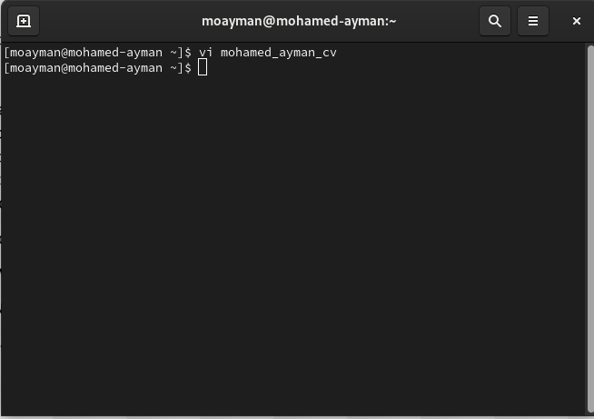

### 2. Open mycv file using vi command then: Without using arrows state how to:

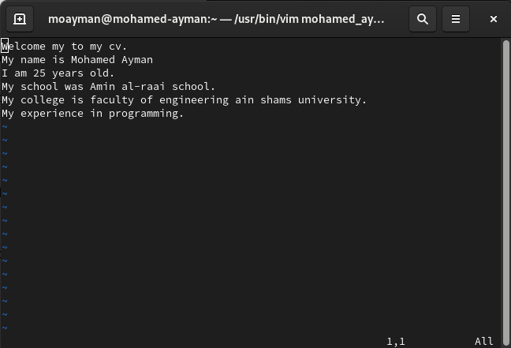

#### a. Move the cursor down one line at time.
using "J" in command mode
#### b. Move the cursor up one line at time.
using "K" in command mode
#### c. Search for word age

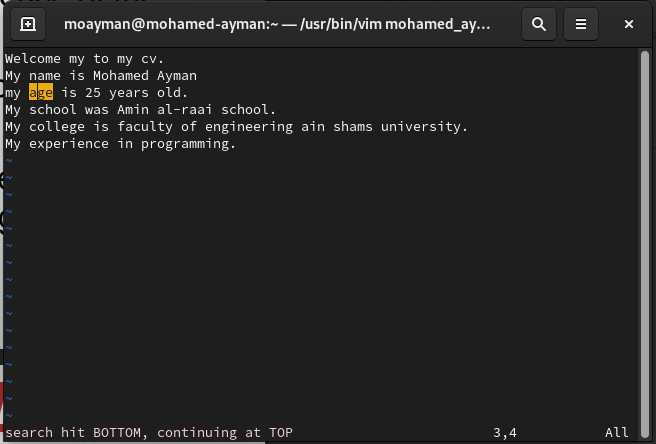

#### d. Step to line 5 (assuming that you are in line 1 and file is more than 5 lines).
using "5G" in command mode 
#### e. Delete the line you are on and line 5.
using command 1,5d
#### f. How to step to the end of line and change to writing mode in one-step.
using "ctrl+e" in command mode
### 3. List the available shells in your system.

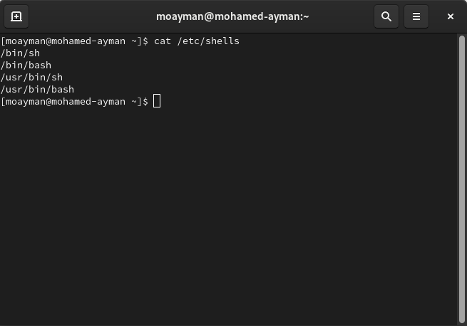

### 4. List the environment variables in your current shell.

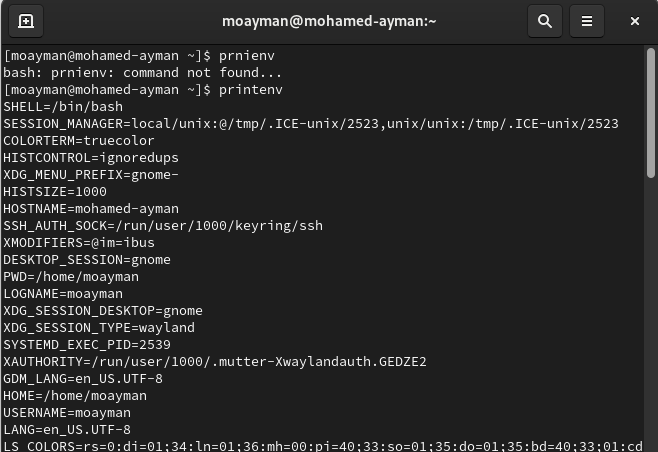

### 5. List all of the environment variables for the bash shell.

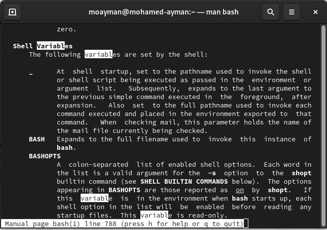

### 6. What are the commands that list the value of a specific variable?

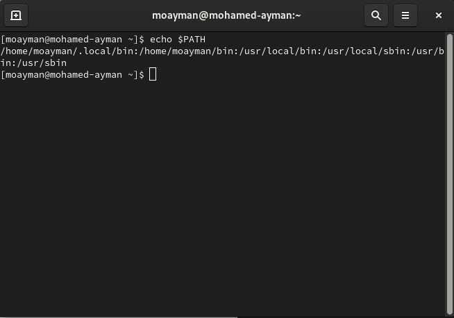

### 7. Display your current shell name.

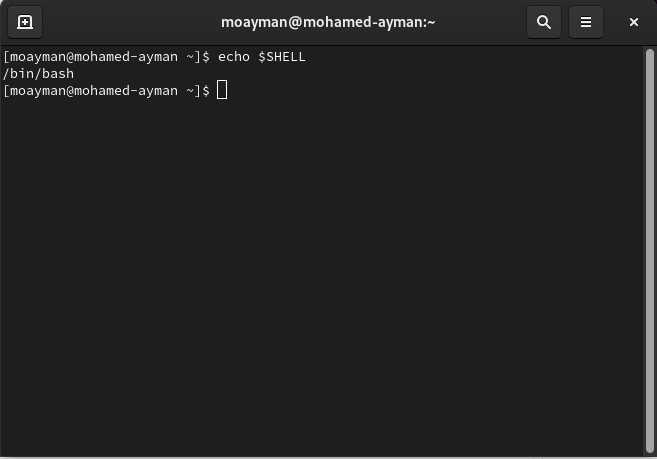

### 8. State the initialization files of: sh, ksh, bash.
### 9. Edit in your profile to display date at login and change your prompt permanently.

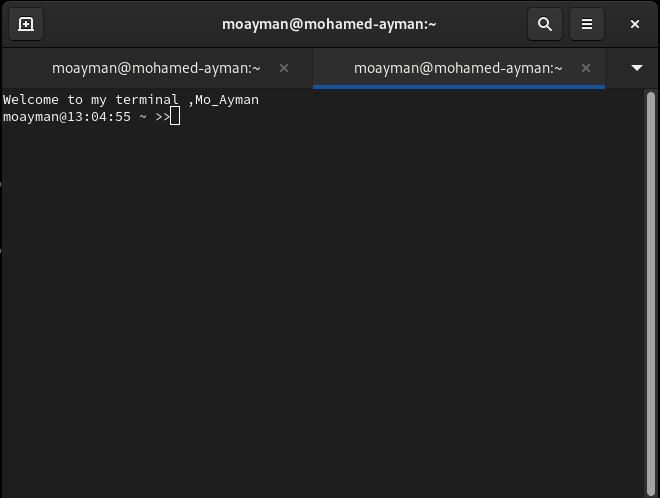
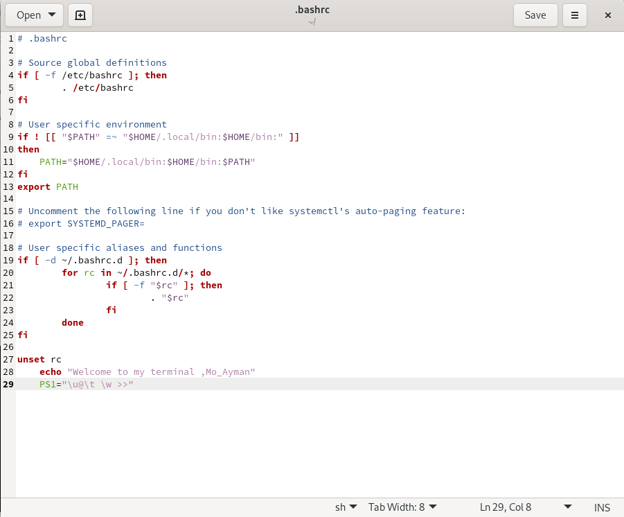
### 10.Execute the following command :
#### echo \ then press enter
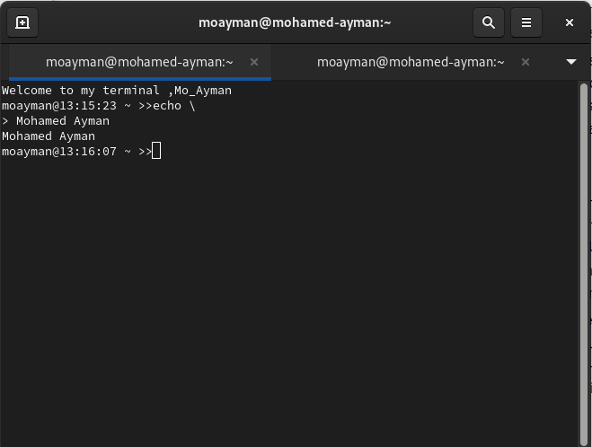
#### What is the purpose of \ ?
to open second prompt to enter string for echo
#### Notice the prompt ”>” what is that? and how can you change it from “>” to “:”.
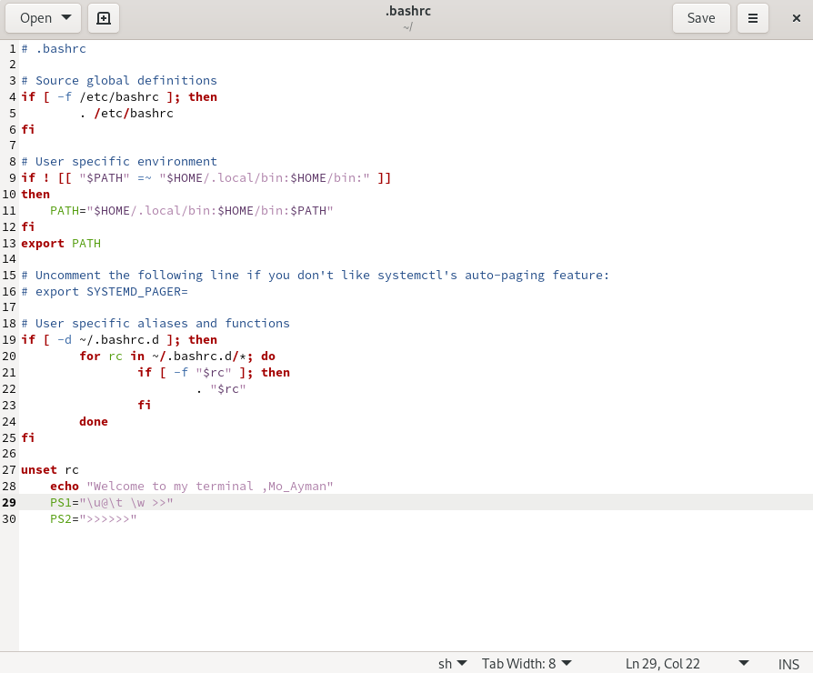
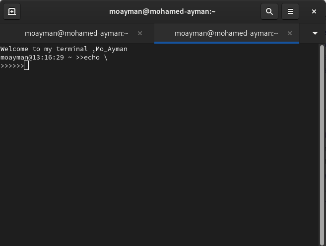
### 11.Create a Bash shell alias named ls for the “ls –l” command
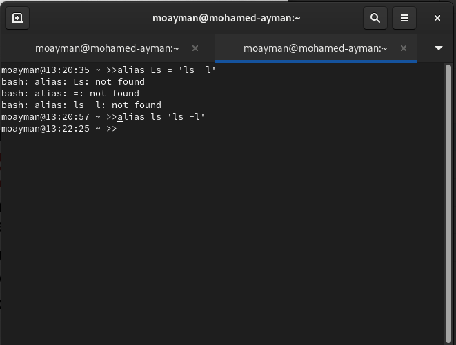
