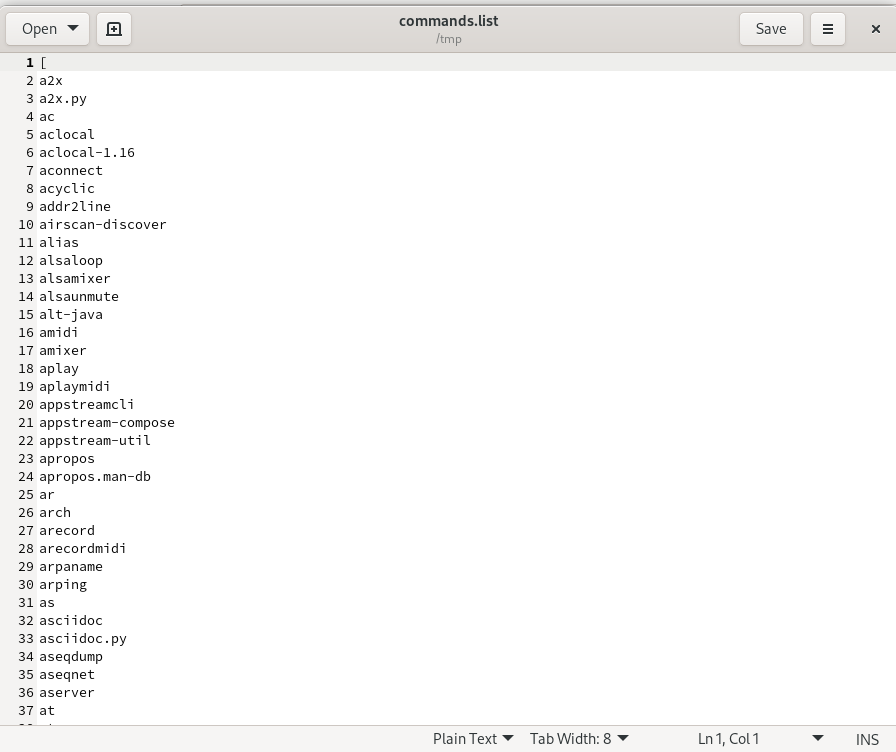
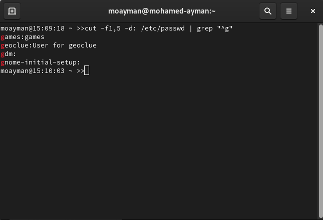
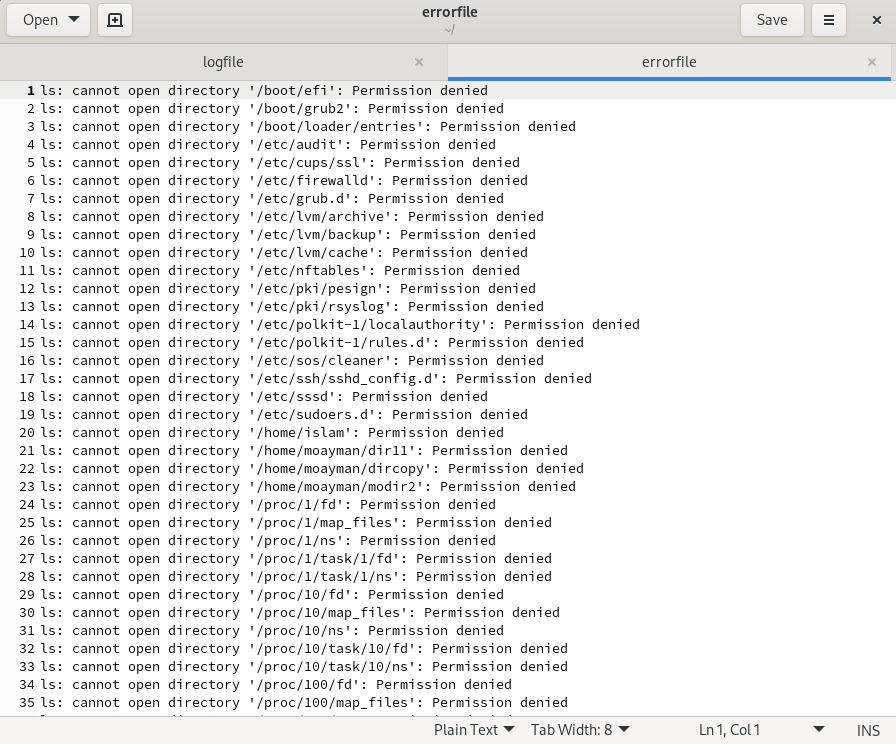
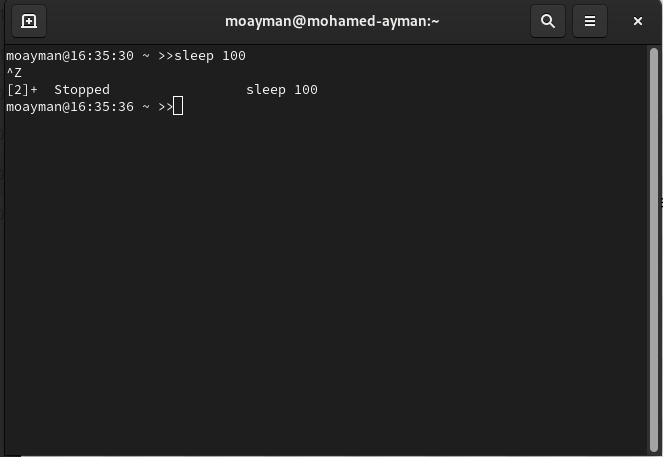

### 1. List the user commands and redirect the output to /tmp/commands.list

### 2. Count the number of user commands

### 3. Get all the users names whose first character in their login is ‘g’.

### 4. Get the logins name and full names (comment) of logins starts with “g”.

### 5. Save the output of the last command sorted by their full names in a file.

### 6. Write two commands: first: to search for all files on the system that named .bash_profile. Second: sorts the output of ls command on / recursively, Saving their output and error in 2different files and sending them to the background.

### 7. Display the number of users who is logged now to the system.

### 8. Display lines 7 to line 10 of /etc/passwd file

### 9. What happens if you execute:

#### cat filename1 | cat filename2

#### ls | rm

#### ls /etc/passwd | wc –l

### 10.Issue the command sleep 100.

### 11.Stop the last command.

### 12.Resume the last command in the background

### 13.Issue the jobs command and see its output.

### 14.Send the sleep command to the foreground and send it again to the background.

### 15.Kill the sleep command.

### 16.Display your processes only

### 17.Display all processes except yours

### 18.Use the pgrep command to list your processes only

### 19.Kill your processes only.

